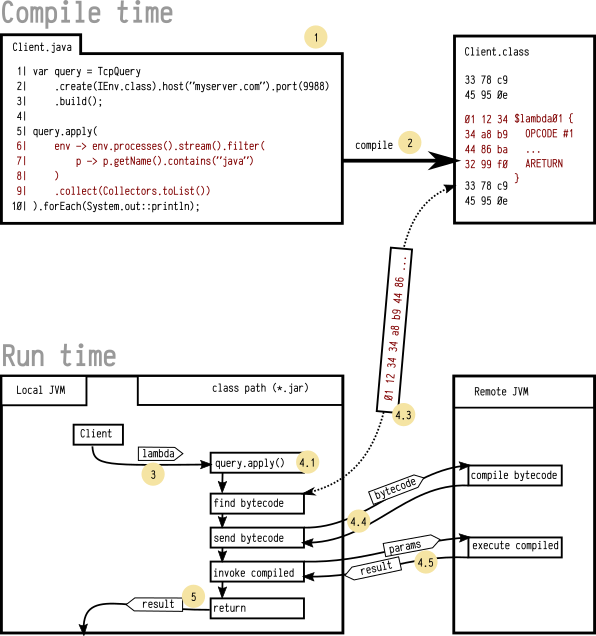

# trambda

- [Intro](https://gochaorg.github.io/trambda/intro.html)
- [План](https://gochaorg.github.io/trambda/plan.html)
- [Core / Ядро](https://gochaorg.github.io/trambda/core.html)
- [TCP клиент / сервер](https://gochaorg.github.io/trambda/tcp.html)

Maven координаты
====================================

```xml
<dependencies>

<dependency>
  <groupId>xyz.cofe</groupId>
  <artifactId>trambda</artifactId>
  <version>1.0</version>
  <type>pom</type>
</dependency>

<dependency>
  <groupId>xyz.cofe</groupId>
  <artifactId>trambda-core</artifactId>
  <version>1.0</version>
</dependency>

<dependency>
  <groupId>xyz.cofe</groupId>
  <artifactId>trambda-tcp</artifactId>
  <version>1.0</version>
</dependency>

<dependency>
  <groupId>xyz.cofe</groupId>
  <artifactId>trambda-tcp-serv-cli</artifactId>
  <version>1.0</version>
</dependency>

</dependencies>
```

Передача лямбда выражений на сервер
====================================

Проект trambda (transportable lambda) - эта передача части байткода JVM
работающего приложения на сервер для последующего исполнения на сервере
без перезапуска самого сервера.

Наглядный пример
-----------------

Давайте рассмотрим пример поиска процесса `java` на компьютере

Допустим у нас есть такой интерфейс IEnv:

```java
public interface IEnv {
    List<OsProc> processes();
}
```

Который возвращает список процессов

```java
public class OsProc implements Serializable {
    public Optional<Integer> getPpid(){ return ... }
    public int getPid(){ return ... }
    public void setPid(int pid){ ... }
    public String getName(){ return ... }
    public Optional<String> getCmdline(){ return ... }
}
```

     1| var query = TcpQuery
     2|     .create(IEnv.class).host("myserver.com").port(9988)
     3|     .build();
     4|  
     5| query.apply( 
     6|     env -> env.processes().stream().filter(
     7|         p -> p.getName().contains("java")
     8|     )
     9|     .collect(Collectors.toList())
    10| ).forEach(System.out::println);

- Строки 1-3 и 10 - выполняются на (локальном) компьютере клиента,
- Строки 6-9 выполняются на сервере (myserver.com)

Как это работает ?
---------------------



При разработке клиентского приложения на Java

1. Мы создаем набор исходных файлов, допустим `Client.java`
2. Компилятор генерирует байткод - файл `Client.class`
3. При вызове `query.apply()` - мы передаем ссылку на лямбду `env -> env.proc...toList())`
4. Реализация `query.apply()`:
    1. Принимает ссылку на лямбду
    2. Для лямбды обнаруживает имя класса (например `Client`)
       и метода (например `lambda1`) реализующего лямбду
    3. Отыскивает среди ресурсов программы
       соответствующий байткод класса (`Client.class`)
       и его метода
    4. Загружает байткод реализации лямбды и отправляет его на сервер
        1. Сервер принимает байткод лямбды
        2. Генерирует в памяти класс в который вставляет принятый байткод
        3. Загружает этот класс в память и через рефлексию получает доступ к лямбде
        4. Возвращает идентификатор этого метода обратно
    5. Принимает идентификатор метода и делает вызов его на сервере
        1. Сервер выполняет ранее скомпилированный класс/метод/лямбду
        2. возвращает результат выполнения
    6. Принимает результат серверного вызова
       и возвращает его как результат локального вызова
5. Возврат результата вызова `query.apply()`

Сравнение с существующими решениями
------------------------------------

Протоколов передачи данных и вызова процедур много, будут рассмотрены некоторые из известных автору.
Эти протоколы можно разделить на несколько категорий/свойств:

* Передача данных
    * Строго ограниченные форматы данных / типы данных
    * Гибкие форматы данных / комбинированные/структурированные типы данных
* Передача программного кода
    * Ограничения на алгоритмы
        * Простые выражения
        * Циклы/ветвления
        * Процедуры/функции/объекты...
        * Ограничения на интерпретацию алгоритмов
        * Слабая типизация
        * Строгая типизация
    * Безопасность
        * авторизация и т.д.
        * время исполнения
        * ... и т.д.
* Поддержка существующий решений
    * Потребность в перезапуске серверов, что бы опробовать новые решения
    * Возможность на ходу опробовать новые решения
    * Профилирование выполнения

| Фича                                      |Java-RMI| SOAP  |REST-JSON | SQL | GraphQL | Hadoop |
|-------------------------------------------|--------|-------|----------|-----|---------|--------|
|Передача данных                            | +      | +     | +        | +   | +       | +      |
|Строго ограниченные форматы данных         | +/-    | +/-   | -        | -   | +       | -      |
|Гибкие форматы данных                      | +/-    | +/-   | +        | +   | -       | +      |
|Передача программного кода                 | -      | -     | -        | +   | -       | +      |
|Простые выражения                          | -      | -     | -        | +   | -       | +      |
|Циклы/ветвления                            | -      | -     | -        | +   | -       | +      |
|Процедуры/функции                          | -      | -     | -        | +   | -       | +      |
|программные объекты...                     | -      | -     | -        | ?   | -       | +      |
|Слабая типизация                           | -      | -     | +        | -   | -       | +      |
|Строгая типизация                          | +      | +     | -        | +   | +       | -      |
|авторизация                                | +      | +     | +        | +   | +       | +      |
|время исполнения                           | ?      | ?     | ?        | +/- | ?       | ?      |
|Потребность в перезапуске серверов         | +      | +     | ?        | -   | +       | -      |
|Возможность находу опробывать новые решения| -      | -     | ?        | +   | -       | +      |
|Профилирование выполнения                  | +      | +     | ?        | +   | +       | ?      |

- Большинство протоколов ориентированы только на передачу данных (Java-RMI, SOAP, REST-JSON, GraphQL)
    - Часть из них работают со строго типизированными данными (Java-RMI, SOAP, GraphQL)
    - Другие (REST-JSON, Hadoop) со слабо типизированными
- Небольшое кол-во протоколов поддерживают еще передачу программного кода (SQL, Hadoop)

Наличие строгой типизации и передачу программного кода из рассмотренных есть только в SQL

В предлагаемом проекте есть следующие возможности, с оговорками

- Передача данных (*)
    - Гибкие форматы данных / комбинированные / структурированные типы данных
- Передача программного кода
    - Простые выражения
    - Циклы/ветвления
    - Процедуры/функции/
    - программные объекты... (**)
- Ограничения на интерпретацию алгоритмов
    - Строгая типизация
    - Безопасность (***)
- Поддержка существующий решений
    - Возможность находу опробовать новые решения
    - Профилирование выполнения (****)

**Оговорки**

- `(*)`
    - передаваемые типы должны быть Serializable
    - требуется апробация Proxy для интерфейсов
- `(**)`
    - требуется апробация Proxy для объектов - очень неоднозначный вопрос
- `(***)`
    - реализована проверка байт-кода,
      без учета текущего пользователя
    - не реализован механизм аутентификации,
      [см план реализации](src/site/markdown/plan.md)
- `(****)`
    - еще не реализовано,
      [см план реализации](src/site/markdown/plan.md)

Область применения
--------------------------

Поскольку проект только начат, говорить о реальном применении рано,
можно говорить о потенциальном применении

Возможны следующий области применения

- фильтрация данных в программах написанных на Java по аналогии SQL WHERE (уже есть)
- выполнение серверных процедур по аналогии RPC/RMI/SOAP/... (уже есть)
- подписка клиента на события сервера
- масштабирование нагрузки (как частный случай реализации сетевого протокола)

При дальнейшем развитии возможно
автоматическая прозрачная трансляция JAVA/Kotlin/Scala кода в целевые системы (SQL, MongoDB, REST, ...)

Данное возможно при условии развития функции декомпиляции байт-кода в код AST/Java/...,
по факту такая функция реализована в декомпиляторе JAD

Что собственно введет к уменьшению издержек при разработке ПО.

Ограничения
-----------------

На текущей стадии реализации есть ряд ограничений,
часть из них можно устранить

- Версия JVM на сервере должна быть не ниже чем на клиенте
- Не все языки/компиляторы поддерживаются, в текущий момент реализовано только Java 11
- Согласованность типов данных сервера и клиента

[Смотрите план реализации.](src/site/markdown/plan.md)
